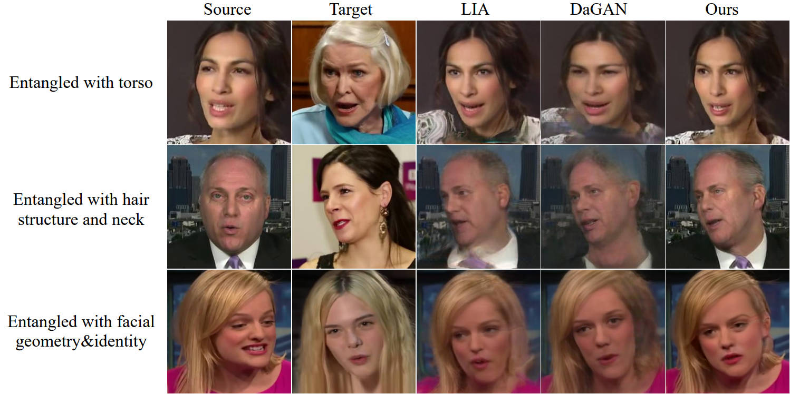
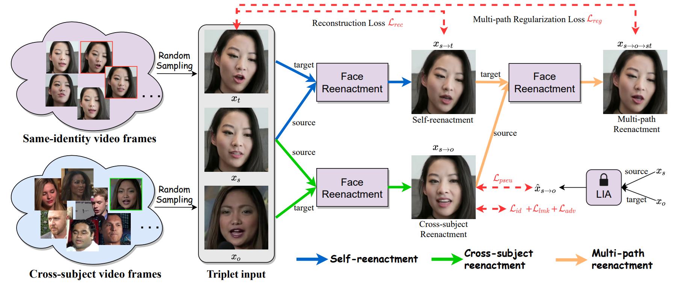
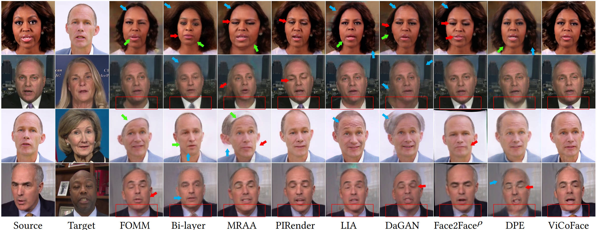

# ViCoFace: Learning Disentangled Latent Motion Representations for Visual-Consistent Face Reenactment

For video results, please refer to https://junleen.github.io/projects/vicoface/

## Introduction

Fig. 1. In the cross-subject reenactment, as the transferred motions are not disentangled from the portrait attributes (e.g., torso, hair structure, neck, facial geometry) of the target image, the motions generally introduce undesirable visual artifacts to the generated results. 

Abstract: *In this work, we propose an effective and cost-efficient face reenactment approach to improve model performance on portrait attributes preservation. Our approach is highlighted by two major strengths. First, based on the theory of latent-motion bases, we decompose the full-head motion into two parts: the transferable motion and preservable motion, and then compose the full motion representation using latent motions from both the source image and the target image. Second, to optimize and learn disentangled motions, we introduce an efficient training framework, which features two training strategies 1) a mixture training strategy that encompasses self-reenactment training and cross-subject training for better motion disentanglement; and 2) a multi-path training strategy that improves the visual consistency of portrait attributes. Extensive experiments on widely used benchmarks demonstrate that our method exhibits remarkable generalization ability, e.g., better motion accuracy and portrait attribute preservation capability, compared to state-of-the-art baselines.*

## Method

Fig. 2. **Illustration of our face reenactment framework.** We incorporate two latent bases for complete latent representation. The encoder E projects an image into transferable latent coefficients and preservable latent coefficients. We employ a latent composition approach to compose latent motions through linear composition. Then, we employ a generator G to gradually synthesize final images from the encoder features and the composed latent motions.

Fig. 3. **Proposed training framework.** Differing from many preceding approaches that only use self-reenactment during training, our training framework incorporates 1) a cross-subject training strategy to minimize the gap between training and inference, and 2) a multi-path reenactment strategy and multi-path regularization loss to improve consistency of visual attributes. For cross-subject training, we introduce four effective losses to stabilize the optimization.

## Visual Results

## Requirements
- We recommend Linux for performance reasons.
- 1 RTX 3090 GPU is needed for real-time inference.
- Python3.6 + PyTorch1.8.1 + cuda11.1.

## Further implementation info
Coming soon.
